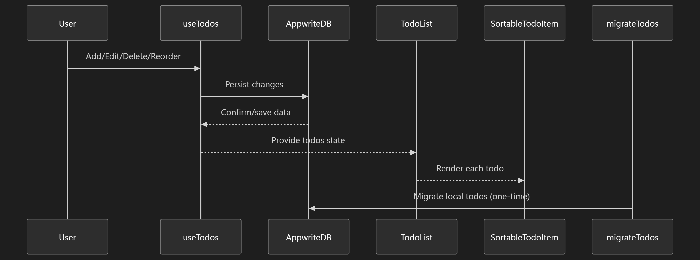

# Comprehensive Review of Todo App Codebase

---

## Architecture Overview

- **Frontend:** React (via Vite), TypeScript, Tailwind CSS, HeroUI components.
- **Backend:** Appwrite services for authentication and data persistence.
- **Drag-and-Drop:** `@dnd-kit` for reordering todos.
- **Routing:** `react-router-dom` with protected routes.
- **State Management:** React Context API (`AuthContext`) and custom hooks (`useTodos`).

---

## Core Functionalities

- **Authentication:** Login/signup with Appwrite, managed via `AuthContext`, protected dashboard with `PrivateRoute`.
- **Todo Management:** Add, edit, delete, toggle, reorder todos with drag-and-drop, persisted in Appwrite, migration from local storage supported.
- **UI/UX:** HeroUI + Tailwind styling, responsive design, customizable loading indicators.

---

## Key Components

| **File/Component**                     | **Role**                                                                                     |
|----------------------------------------|----------------------------------------------------------------------------------------------|
| `src/App.tsx`                         | Routing setup, wraps app in `AuthProvider`.                                                  |
| `src/pages/landing/index.tsx`         | Landing page with info and auth options.                                                     |
| `src/pages/auth/login.tsx` & `signup.tsx` | Login and signup forms, use `AuthContext`.                                               |
| `src/pages/dashboard/index.tsx`       | Main dashboard, private route, manages todos.                                                |
| `src/components/todo-list.tsx`        | Renders list of todos, drag-and-drop enabled.                                                |
| `src/components/sortable-todo-item.tsx` | Individual todo item, sortable, edit/delete/toggle.                                       |
| `src/contexts/auth-context.tsx`       | Provides auth state and methods.                                                             |
| `src/hooks/useTodos.ts`               | Custom hook for todo logic and Appwrite integration.                                         |
| `src/components/private-route.tsx`    | Protects routes, supports role-based access, loading state.                                  |
| `src/components/loading-indicator.tsx`| Reusable spinner with options.                                                               |
| `src/lib/appwriteConfig.ts`           | Appwrite client setup, exports Account & Database services.                                 |
| `src/utils/migrateTodos.ts`           | Migrates todos from local storage to Appwrite.                                               |
| `src/utils/spa-routing-fix.ts`        | SPA routing fix for deployment, prevents 404s.                                               |

---

## Data Flow

### Authentication Flow

---

### Todo Data Flow

---

## Design Principles

- **Component-based modular design.**
- **Context API for global auth state.**
- **Custom hooks for encapsulated logic.**
- **Protected routing with role-based access.**
- **Type safety with TypeScript interfaces.**
- **Utility-first styling with Tailwind CSS.**
- **SPA routing fix for smooth deployment.**
- **Migration support for data transition.**

---

## Planned Enhancements

- **Deeper Appwrite integration:** Storage, Functions, enhanced permissions, offline-first.
- **Feature expansion:** Categories, due dates, priorities, sharing, search/filter.
- **UI/UX improvements:** Better loading, animations, mobile responsiveness.
- **Quality assurance:** More tests, CI/CD, error monitoring.

---

*Generated on 2025-04-05*